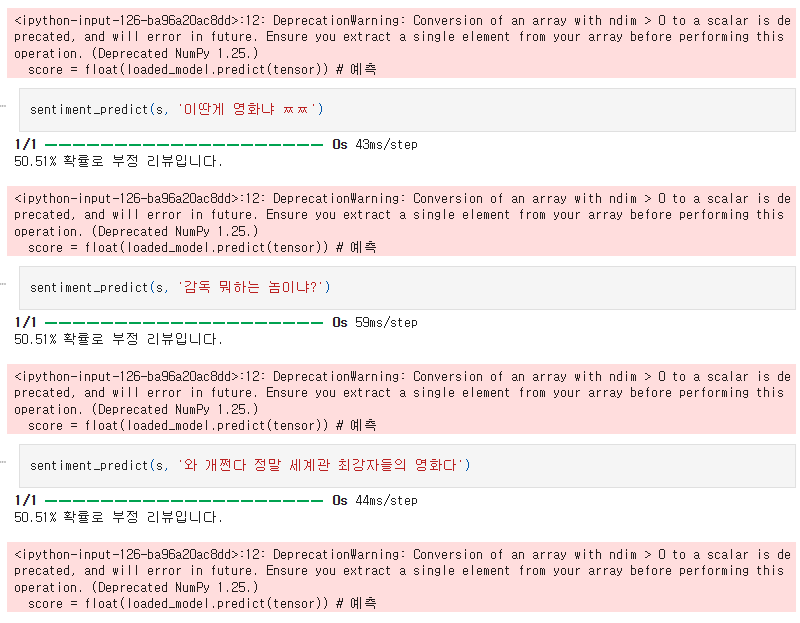
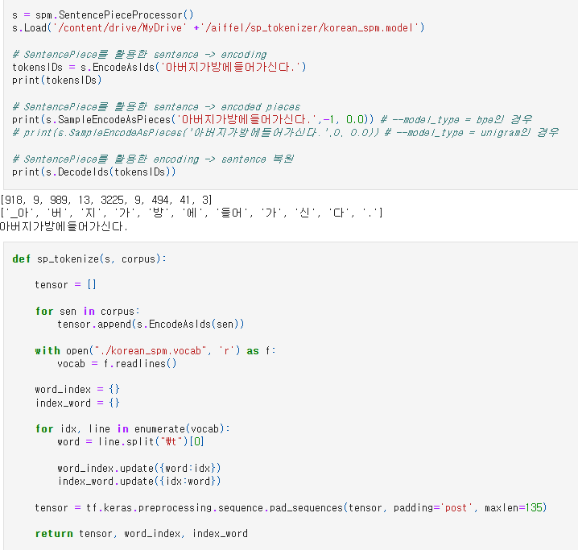
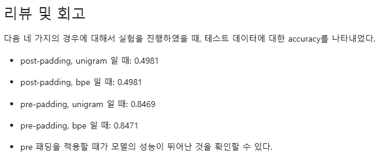
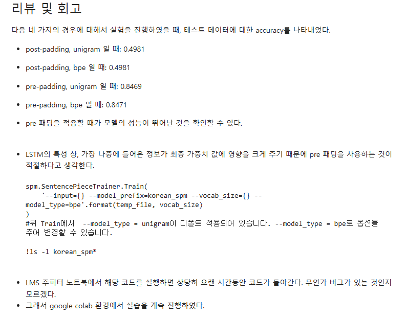
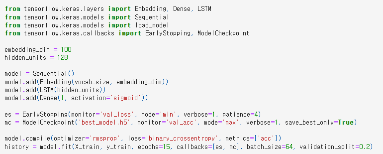

# AIFFEL Campus Online Code Peer Review Templete
- 코더 : 김천지
- 리뷰어 : 염철헌


# PRT(Peer Review Template)
- [X]  **1. 주어진 문제를 해결하는 완성된 코드가 제출되었나요?**
    - 문제에서 요구하는 최종 결과물이 첨부되었는지 확인
        - 중요! 해당 조건을 만족하는 부분을 캡쳐해 근거로 첨부
        - 
        - 기타 테스트에 대한 기록 뿐 아니라, 직접 텍스트를 생성하여 예측하는 시도를 포함
        
    
- [X]  **2. 전체 코드에서 가장 핵심적이거나 가장 복잡하고 이해하기 어려운 부분에 작성된 
주석 또는 doc string을 보고 해당 코드가 잘 이해되었나요?**
    - 해당 코드 블럭을 왜 핵심적이라고 생각하는지 확인
    - 해당 코드 블럭에 doc string/annotation이 달려 있는지 확인
    - 해당 코드의 기능, 존재 이유, 작동 원리 등을 기술했는지 확인
    - 주석을 보고 코드 이해가 잘 되었는지 확인
        - 중요! 잘 작성되었다고 생각되는 부분을 캡쳐해 근거로 첨부
        - 
        - SentencePiece를 활용하여 토크나이저를 구성하고 함수를 통해 모듈화한 것, 추가로 maxlen과 padding의 위치 등에 관해서 PR 과정에서 대화가 잘 오고갔음
        
- [X]  **3. 에러가 난 부분을 디버깅하여 문제를 해결한 기록을 남겼거나
새로운 시도 또는 추가 실험을 수행해봤나요?**
    - 문제 원인 및 해결 과정을 잘 기록하였는지 확인
    - 프로젝트 평가 기준에 더해 추가적으로 수행한 나만의 시도, 
    실험이 기록되어 있는지 확인
        - 중요! 잘 작성되었다고 생각되는 부분을 캡쳐해 근거로 첨부
        - 
        - PR 과정에서의 피드백과 더불어 여러 패딩과 인코딩에 대해서 실험을 기록함
        
- [X]  **4. 회고를 잘 작성했나요?**
    - 주어진 문제를 해결하는 완성된 코드 내지 프로젝트 결과물에 대해
    배운점과 아쉬운점, 느낀점 등이 기록되어 있는지 확인
    - 전체 코드 실행 플로우를 그래프로 그려서 이해를 돕고 있는지 확인
        - 중요! 잘 작성되었다고 생각되는 부분을 캡쳐해 근거로 첨부
        - 
        - 중요한 파라미터에 대한 분석을 회고에 기록
        
- [X]  **5. 코드가 간결하고 효율적인가요?**
    - 파이썬 스타일 가이드 (PEP8) 를 준수하였는지 확인
    - 코드 중복을 최소화하고 범용적으로 사용할 수 있도록 함수화/모듈화했는지 확인
        - 중요! 잘 작성되었다고 생각되는 부분을 캡쳐해 근거로 첨부
        - 
        - 간단한 케라스 모델을 구현하여 콜백 등의 함수까지 포함


# 회고(참고 링크 및 코드 개선)
```
# 리뷰어의 회고를 작성합니다.
# LSTM에서 포스트 패딩이 불리하다는 것을 생각하지 못 하신 턱에 gradient vanishing으로 인해 학습이 전혀 진행되지 못하고 모델이 1개의 클래스로 전부 일자긋기 해버리는 현상이 있었는데, 예전에도 제가 먼저 겪은 문제여서 PR 과정에서 바로 해결할 수 있어 다행이었습니다.
# 코드 리뷰 시 참고한 링크가 있다면 링크와 간략한 설명을 첨부합니다.
# 코드 리뷰를 통해 개선한 코드가 있다면 코드와 간략한 설명을 첨부합니다.
```

